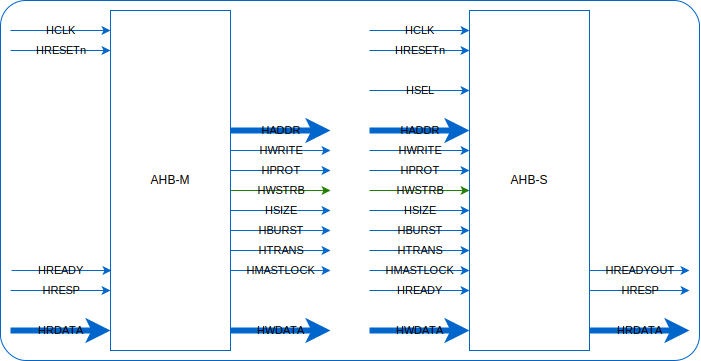
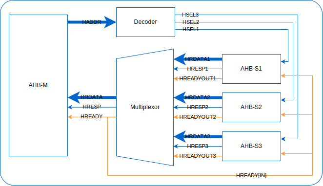
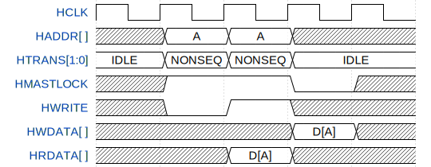
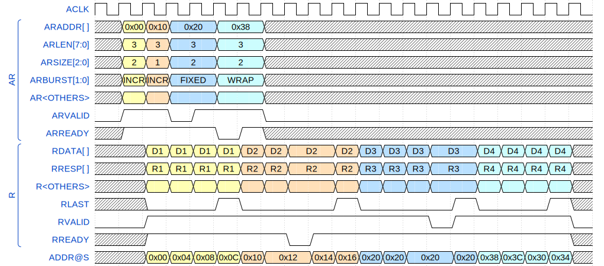
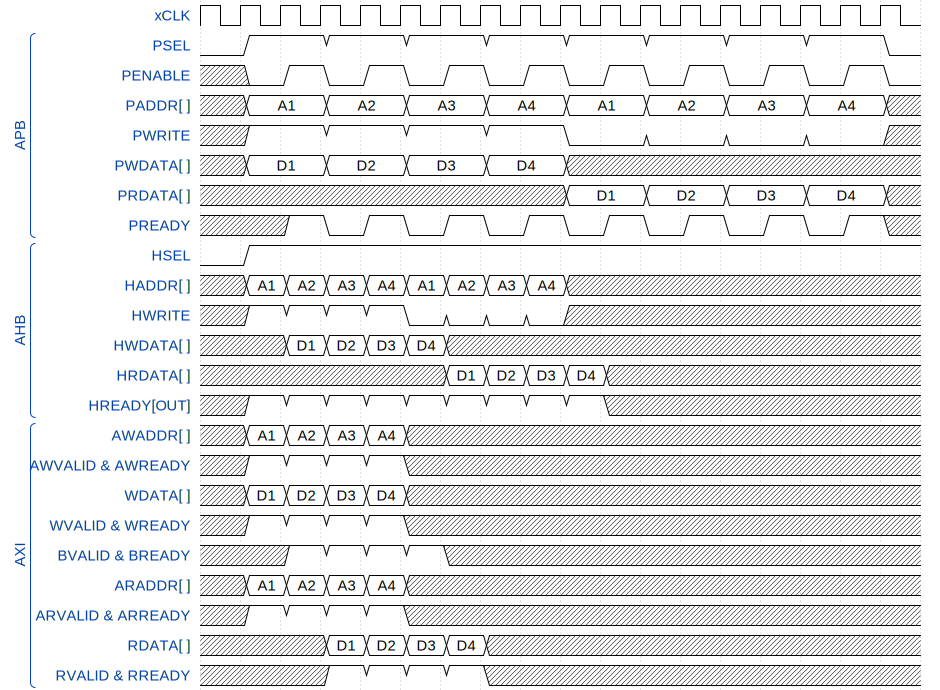

<!-- ###################################################################### -->
## AMBA APB, AHB and AXI
### from a practical point of view
<!-- .slide: data-background="#145A32" -->
<!-- ###################################################################### -->

[rodrigomelo9.github.io/amba](https://rodrigomelo9.github.io/amba)

Rodrigo Alejandro Melo

[Creative Commons Attribution 4.0 International](https://creativecommons.org/licenses/by/4.0/)

---
<!-- ###################################################################### -->
### Introduction
<!-- ###################################################################### -->

While delving into the AMBA specifications, it's worth noting that they can be challenging to understand. In most cases, not all features are essential, and waveforms are often limited or no provided at all. Although tutorials are available, they typically represent adaptations of the spec, lacking real-world context.
<!-- .element: style="font-size: 0.8em !important; width: 30em;" -->

Our focus in this presentation is on AMBA interfaces commonly present in SoC IPs. We'll assume the interconnect is already addressed, cutting through the complexity and providing practical insights for system design.
<!-- .element: style="font-size: 0.8em !important; width: 30em;" -->

> If you still want to start from AMBA specs, I recommend APB4, AHB3 and AXI4.
<!-- .element: style="font-size: 0.6em !important; width: 40em;" -->

---
<!-- ###################################################################### -->
### Outline
<!-- ###################################################################### -->

* [AMBA](#/3)
* [APB](#/4)
* [AHB](#/5)
* [AXI](#/6)
* [AXI-Full](#/7)
* [AXI-Lite](#/8)
* [AXI-Stream](#/9) (WIP)
* [Interconnect](#/10)
* [Final remarks](#/11)

---
<!-- ###################################################################### -->
### AMBA
#### Advanced Microcontroller Bus Architecture
<!-- .slide: data-background="#581845" -->
<!-- ###################################################################### -->

----

### Description

AMBA is a freely available, globally adopted, open standard for the connection and management of functional blocks in a System-on-Chip (SoC).
It facilitates right-first-time development of multiprocessor designs, with large numbers of controllers and peripherals.

----

### AMBA specifications

|                                     | AMBA          | AMBA2          | AMBA3              | AMBA4                       | AMBA5
| :---:                               | :---:         | :---:          | :---:              | :---:                       | :---:
|                                     |               |                |                    | AXI4-Stream (2010)       | AXI5-Stream (2021)
| Advanced eXtensible Interface |               |                | AXI3 (2003/4)   | AXI4 AXI4-Lite (2010) | AXI5 AXI5-Lite (2017/21)
| Advanced High-performance Bus |               | AHB (1999)  | AHB-Lite (2006) |                             | AHB5 AHB5-Lite (2015/21)
| Advanced System Bus           | ASB (1996) | ASB (1996)  |                    |                             |
| Advanced Peripherals Bus      | APB (1996) | APB2 (1999) | APB3 (2003/4)   | APB4 (2010)              | APB5 (2021)
<!-- .element: style="font-size: 0.5em !important;" -->

> **ATTENTION:** ASB and the first APB are deprecated (shouldn't be used in new designs).
<!-- .element: style="font-size: 0.6em !important; width: 40em;" -->

----

### Terminology

Term        | Description
---         |---
Interface   | APB, AHB, AXI (a core could have multiple)
Channel     | Independent collection of AXI signals associated to a VALID
Bus         | Multi-bit signal (not an interface, not a channel)
Transfer    | (aka beat) single clock cycle, qualified by a VALID/READY handshake
Transaction | Complete communication, with one or more transfers
Burst       | Transaction with more than one transfer
Manager     | Agent that initiates transactions (aka requester, transmitter)
Subordinate | Agent that receives and responds to requests (aka completer, receiver)
<!-- .element: style="font-size: 0.5em !important;" -->

----

### General considerations

* All signals are sampled at the rising edge of xCLK.
* xRESETn is the only active low signal.

<!-- .element: style="background-color: white;" -->

* xADDR indicates a byte address.

> **ATTENTION:** TRANSFERS are initiated by M, finished by S, and **CAN'T BE CANCELED!!!**
<!-- .element: style="font-size: 0.6em !important; width: 40em;" -->

---

<!-- ###################################################################### -->
### APB
#### Advanced Peripherals Bus
<!-- .slide: data-background="#581845" -->
<!-- ###################################################################### -->

----

### Description

A low-cost interface, optimized for minimal power consumption and reduced complexity.
It is not pipelined and is a simple, synchronous protocol.
Every transfer takes at least two cycles to complete.

Main uses:
* Low bandwidth/speed peripherals
* Control/Status registers

----

### APB signals

|                | APB2  | APB3  | APB4  | APB5  | Default | Description
| ---            | :---: | :---: | :---: | :---: | :---:   | ---
| PCLK           | Y     | Y     | Y     | Y     |         | Clock
| PRESETn        | Y     | Y     | Y     | Y     |         | Reset
| PADDR[A-1:0]   | Y     | Y     | Y     | Y     |         | Address (up to 32 bits)
| PSELx          | Y     | Y     | Y     | Y     |         | COMPLETER x selected
| PENABLE        | Y     | Y     | Y     | Y     |         | Enable
| PWRITE         | Y     | Y     | Y     | Y     |         | Write operation
| PWDATA[D-1]    | Y     | Y     | Y     | Y     |         | Write Data. (8, 16 or 32 bits)
| PRDATA[D-1]    | Y     | Y     | Y     | Y     |         | Read Data (8, 16 or 32 bits)
| PREADY         |       | O     | O     | O     | 1'b1    | Indicates the completion of a transfer
| PSLVERR        |       | O     | O     | O     | 1'b0    | Indicates an error condition
| PPROT[2:0]     |       |       | O     | O     | '0      | Normal, privileged, or secure protection level
| PSTRB[D/8-1:0] |       |       | O     | O     | '1      | Write Strobe (bytes to update during a write)
| PWAKEUP        |       |       |       | O     |         | Wake-up
| PxUSER[]       |       |       |       | O     |         | User defined attribute
| PxCHK          |       |       |       | O     |         | Parity protection (for safety-critical applications)
<!-- .element: style="font-size: 0.4em !important;" -->

----

### APB4-S interface

----

### APB4 Signaling

<!-- .element: style="background-color: white;" -->

----

### APB3 - PREADY

* COMPLETER can use PREADY to extend (introduce wait states) transfers.
* Peripherals with fixed two-cycle access can set PREADY always HIGH.

----

### APB3 - PSLVERR

* Can be used to indicate an ERROR condition (error, unsupported, timeout, etc).
* A WRITE transaction with ERROR, might or might not have updated the state of the peripheral.
* A READ transaction with ERROR, might or might not provide valid data.

----

### APB4 - PSTRB

* Enables sparse data transfer on the write data bus
* There is one bit per each byte of PWDATA
  * PSTRB[n] -> PWDATA[(8n + 7):(8n)]
* When asserted HIGH, the corresponding byte of PWDATA contains valid information

> During read transfers, all the bits of PSTRB **must** be driven LOW.
<!-- .element: style="font-size: 0.6em !important; width: 40em;" -->

----

### APB4 - PPROT

* PPROT[0]: Normal or Privileged
* PPROT[1]: Secure or Non-secure
* PPROT[2]: Data or Instruction

> * The primary use of PPROT is as an identifier for Secure or Non-secure transactions (it is acceptable to use different interpretations for PPROT[0] and PPROT[2]).
> * PPROT[2] is provided as a hint, but might not be accurate in all cases.
> * **ATTENTION:** a wrong value on `PPROT` can lead to an incorrect system behavior.
<!-- .element: style="font-size: 0.6em !important; width: 40em;" -->

----

### Unaligned transfers

PADDR can be unaligned, but the result is UNPREDICTABLE (COMPLETER may utilize the unaligned address, aligned address, or indicate an error response).

----

### Operating States
<!-- .slide: data-background="yellow" -->

> When a transfer is required, the interface moves into the SETUP state, where the appropriate PSELx is asserted.
> The interface remains in this state for one clock cycle and always moves to the ACCESS state, where PENABLE is asserted.
<!-- .element: style="font-size: 0.4em !important; width: 50em;" -->

----

### Validity rules
<!-- .slide: data-background="yellow" -->

| Always | PSEL    | PSEL & PENABLE | PSEL & PENABLE & PREADY |
| :---:  | :---:   | :---:          | :---:                   |
| PSEL   | PENABLE | PREADY         | PRDATA                  |
|        | PADDR   |                | PSLVERR                 |
|        | PPROT   |                |                         |
|        | PSTRB   |                |                         |
|        | PWDATA  |                |                         |
<!-- .element: style="font-size: 0.5em !important;" -->

> * **Until APB4:** it is **recommended** that address and write signals not be changed immediately after a transfer, but remain stable until the next one (this reduces power consumption).
> * **APB5:** signals that are not required to be valid **should** be driven to zero.
<!-- .element: style="font-size: 0.4em !important;" -->

---

<!-- ###################################################################### -->
### AHB
#### Advanced High-performance Bus
<!-- .slide: data-background="#581845" -->
<!-- ###################################################################### -->

----

### Description

A high-performance, high-bandwidth, interface, that supports burst data transfers.
It is a **pipelined**, synchronous protocol.

Main uses:
* Internal memory devices
* External memory interfaces
* High-bandwidth peripherals

----

### AHB signals

|               | AHB2     | AHB-Lite  | AHB5    | Default | Description
| ---           | :---:    | :---:     | :---:   | :---:   | ---
| HCLK          | Y        | Y         | Y       |         | Clock
| HRESETn       | Y        | Y         | Y       |         | Reset
| HADDR[]       | Y        | Y         | Y       |         | Address (32-bits, between 10 and 64 in AHB5)
| HSELx         | Y        | Y         | Y       |         | Selected (combinatorial decode of the address bus)
| HTRANS[1:0]   | Y        | Y         | Y       |         | Transfer type (IDLE, BUSY, NONSEQ, SEQ)
| HWRITE        | Y        | Y         | Y       |         | Write operation
| HSIZE[2:0]    | Y        | Y         | Y       |         | Size of the transfer (2^SIZE bytes)
| HBURST[2:0]   | O        | O         | O       | 3'b001  | Burst length and address increments
| HPROT[3:0]    | O        | O         | O       | 4'b0011 | Protection level
| HWDATA[]      | Y        | Y         | Y       |         | WR (8, 16, 32, 64, 128, 256, 512, 1024 bits)
| HRDATA[]      | Y        | Y         | Y       |         | RD (8, 16, 32, 64, 128, 256, 512, 1024 bits)
| HWSTRB[D/8-1] |          | O (AMBA5) | O       | '1      | Write Strobe (bytes to update during a write)
| HREADY        | Y        | Y         | Y       |         | (IN) other transfers completed
| HRESP         | Y [1:0]  | Y         | Y       |         | Transfer response
| HBUSREQx      | Y        |           |         |         | Bus required
| HLOCKx        | Y        |           |         |         | Locked access required
| HGRANTx       | Y        |           |         |         | Locked access has the highest priority
| HMASTER[]     | O [3:0]  |           | O [7:0] | '0      | Manager identifier
| HMASTLOCK     | O        | O         | O       | 1'b0    | Current transfer is part of a locked sequence
| HSPLITx[15:0] | Y        |           |         |         | M to re-attempt a split transaction
| HREADYOUT     |          | Y         | Y       |         | (OUT) transfer has finished
| HNONSEC       |          |           | O       | 1'b0    | Indicates Non-secure transaction
| HEXCL         |          |           | O       | 1'b0    | Exclusive Access
| HEXOKAY       |          |           | O       | 1'b0    | Exclusive Okay
| HxUSER[]      |          |           | O       |         | User defined attribute
| HxCHKx        |          |           | O       |         | Parity protection (for safety-critical applications)
<!-- .element: style="font-size: 0.3em !important;" -->

----

### AHB-Lite interfaces

----

### AHB-Lite interconnection

> * HSELx, HADDR and control **must** be sampled when HREADY is HIGH (previous transfer is completed).
>   * A SUBORDINATE cannot request that the address phase be extended.
> * HREADYOUT is driven during the data phase: LOW extends the transfer; HIGH finishes the transfer.
> * The INTERCONNECT is responsible for combining all the HREADYOUT to generate a single HREADY (aka HREADYIN).
<!-- .element: style="font-size: 0.5em !important; width: 50em;" -->

----

### AHB-Lite Signaling (basic transfers)

<!-- .element: style="background-color: white;" -->

----

### AHB-Lite Signaling (multiple transfers)

<!-- .element: style="background-color: white;" -->

> Extending the data phase of transfer B has the effect of extending the address phase of transfer C.
<!-- .element: style="font-size: 0.5em !important; width: 40em;" -->

----

### AHB - HTRANS (transfer types)

| HTRANS[1:0] | Type   | Description                                                                                                           |
| :---:       | :---:  | ---                                                                                                                   |
| 2'b00       | IDLE   | No data transfer is required                                                                                          |
| 2'b01       | BUSY   | Insert idle cycles in the middle of a burst (address and control signals must reflect the next transfer in the burst) |
| 2'b10       | NONSEQ | Single transfer or first transfer of a burst (address and control signals are unrelated to the previous transfer)     |
| 2'b11       | SEQ    | Remaining transfers in a burst (control information is identical to the previous transfer, address is adjusted)       |
<!-- .element: style="font-size: 0.5em !important;" -->

> During a waited transfer:
> * HTRANS can change from IDLE to NONSEQ. When it changes to NONSEQ, it must keep constant until HREADY is HIGH.
> * For a fixed-length burst, HTRANS can change from BUSY to NONSEQ. When it changes to SEQ, it must keep constant until HREADY is HIGH.
> * During an INCR, HTRANS can change from BUSY to any other transfer type. The burst continues if a SEQ is performed but terminates in other cases.
<!-- .element: style="font-size: 0.6em !important; width: 40em;" -->

----

### AHB - HSIZE (transfer size)

Indicates the size (bytes) of a data transfer (**must** be less than or equal to the width of the data bus).

| HSIZE[2:0] | Bytes |
| :---:      | :---: |
| 3'b000     | 1     |
| 3'b001     | 2     |
| 3'b010     | 4     |
| 3'b011     | 8     |
| 3'b100     | 16    |
| 3'b101     | 32    |
| 3'b110     | 64    |
| 3'b111     | 128   |
<!-- .element: style="font-size: 0.5em !important;" -->

> * HSIZE **must** remain constant during a burst transfer.
> * SIZE = `2^HSIZE` (or `1<<HSIZE`).
<!-- .element: style="font-size: 0.6em !important; width: 40em;" -->

----

### AHB - HBURST (burst types)

| HBURST[2:0] | Type        | Description
| :---:       | :---:       | ---
| 3'b000      | SINGLE      | Single burst
| 3'b001      | INCR        | Incrementing burst of undefined length
| 3'b010      | WRAP4       | Wrapping burst (4 beats)
| 3'b011      | INCR4       | Incremental burst (4 beats)
| 3'b100      | WRAP8       | Wrapping burst (8 beats)
| 3'b101      | INCR8       | Incremental burst (8 beats)
| 3'b110      | WRAP16      | Wrapping burst (16 beats)
| 3'b111      | INCR16      | Incremental burst (16 beats)
<!-- .element: style="font-size: 0.5em !important;" -->

> * Managers **must** not attempt to start an incrementing burst that crosses a 1KB address boundary.
> * The total amount of data transferred in a burst is calculated multiplying the number of beats by the amount of data (as indicated by HSIZE[2:0]).
> * Transfers in a burst **must** be aligned to the address boundary (as indicated by HSIZE[2:0]).
> * Wrapping bursts wrap when they cross an address boundary (BEATS x SIZE).
<!-- .element: style="font-size: 0.4em !important;" -->

----

### AHB - WRAP4/INCR4 example

<!-- .element: style="background-color: white;" -->

----

### AHB - Undefined INCR example

<!-- .element: style="background-color: white;" -->

> HADDR increment when HBURST > 0 depends on HSIZE.
<!-- .element: style="font-size: 0.5em !important; width: 40em;" -->

----

### AHB - HRESP (transfer response)

> HRESP is used to indicate an ERROR condition.
> OKAY response can be given in a single cycle, but for ERROR two cycles are required.
> In the first cycle, HREADY must be LOW, and HIGH in the second.
> The two cycles are needed because of the pipelined nature of the bus (when ERROR response starts,
> the address of the following transfer is already available).
<!-- .element: style="font-size: 0.4em !important; width: 50em;" -->

<!-- .element: style="background-color: white;" -->

> * In case of IDLE and BUSY, a zero wait state OKAY response **must** always provide, and the transfer **must** be ignored.
> * If an ERROR response is received, the remaining transfers in a burst can be canceled, but it is also acceptable to continue.
<!-- .element: style="font-size: 0.4em !important; width: 50em;" -->

----

### AHB5 - HWSTRB
<!-- .slide: data-background="cyan" -->

* Enables sparse data transfer on the write data bus
* There is one bit per each byte of HWDATA
  * HWSTRB[n] -> HWDATA[(8n + 7):(8n)]
* When asserted HIGH, the corresponding byte of HWDATA contains valid information

> * During read transfers, it is recommended that write strobes are deasserted.
> * Write transfers with all HWSTRB deasserted are permitted (no bytes are written).
> * HWSTRB can change between beats of a burst.
<!-- .element: style="font-size: 0.5em !important; width: 40em;" -->

----

### AHB - HPROT

* HPROT[0]: Data/Opcode
* HPROT[1]: Privileged
* HPROT[2]: Buffereable
* HPROT[3]: Cacheable

> * HPROT **must** remain constant during a burst transfer.
> * A subordinate shouldn't use HPROT unless absolutely necessary.
> * **ATTENTION:** a wrong value on `HPROT` can lead to an incorrect system behavior.
<!-- .element: style="font-size: 0.6em !important; width: 40em;" -->

----

### AHB - HMASTLOCK (locked transfers)

Indicates that the current transfer sequence is indivisible (typically used to maintain the integrity of a semaphore).
<!-- .element: style="font-size: 0.8em !important;" -->

<!-- .element: style="background-color: white;" -->

> After a locked transfer, it is recommended to insert an IDLE transfer.
<!-- .element: style="font-size: 0.5em !important; width: 40em;" -->

----

### The full picture

<!-- .element: style="background-color: white;" -->

----

### Unaligned transfers

> "All transfers in a burst must be aligned to the address boundary equal to the size of the transfer".
<!-- .element: style="font-size: 0.5em !important; width: 40em;" -->

Nothing more is said in the specification about unaligned transfers.

----

### AHB2 - HRESP
<!-- .slide: data-background="yellow" -->

HRESP was 2 bits wide in AHB2, to support SPLIT and RETRY, something that was removed on AMBA3.

----

### Validity rules
<!-- .slide: data-background="yellow" -->

| Always      | HTRANS!=IDLE | WR data phase | RD data phase & HREADYOUT & !HRESP |
| :---:       | :---:        | :---:         | :---:                              |
| HSEL        | HBURST       | HWDATA        | HRDATA                             |
| HADDR       | HSIZE        | HWSTRB        |                                    |
| HTRANS      | HPROT        |               |                                    |
| HMASTLOCK   | HWRITE       |               |                                    |
| HREADY[OUT] |              |               |                                    |
| HRESP       |              |               |                                    |
<!-- .element: style="font-size: 0.5em !important;" -->

> * Signals which are not required to be valid can take any value, but 0 or X are recommended.
> * In data transfers with invalid byte lanes, it is recommended that those be 0.
<!-- .element: style="font-size: 0.4em !important;" -->

---
<!-- ###################################################################### -->
### AXI
#### Advanced eXtensible Interface
<!-- .slide: data-background="#581845" -->
<!-- ###################################################################### -->

----

### Flavours

* **Full:** memory-mapped high-performance interface (higher than AHB), that supports burst transactions.
* **Lite:** a lightweight/simpler interface, without burst support, mainly intended for Control/Status registers.
* **Stream:** a reduced high-performance streaming interface, for unidirectional data transfer.

----

### AXI Channels

Each channel transfers INFO in one direction, and there isn't a fixed relationship between channels, so registers (for timing closure) can be inserted in any channel, at the expense of an additional cycle of latency.
<!-- .element: style="font-size: 0.4em !important; width: 55em;" -->

----

### AXI Handshake

<!-- .element: style="background-color: white;" -->

> * Each independent channel consists of INFO plus VALID and READY signals that provide a two-way handshake mechanism.
> * The source uses the xVALID signal to indicate valid INFO is available on the channel.
>   * It is not permitted to wait until xREADY is asserted before asserting xVALID.
>   * When asserted, it **must** remain asserted until the slave asserts xREADY.
> * The destination uses the xREADY signal to accept INFO.
>   * It is permitted to wait for xVALID to be asserted before asserting the corresponding xREADY.
>   * If xREADY is asserted, it is permitted to deassert xREADY before xVALID is asserted.
>   * Its default value can be HIGH or LOW, but HIGH is recommended
> * During reset, xVALID **must** be LOW.
>   * All other signals can be driven to any value.
<!-- .element: style="font-size: 0.4em !important; width: 55em;" -->

**ATTENTION:** there **must** be no combinatorial paths between input and output signals.
<!-- .element: style="font-size: 0.4em !important;" -->

----

### Dependencies between channel handshake signals

<!-- .element: style="background-color: white;" -->

> * Single arrows point to signals that can be asserted before of after the signal at the start of the arrow.
> * Double arros point to signals that must be assserted only after assertion of the signal at the start of the arrow.
<!-- .element: style="font-size: 0.4em !important; width: 55em;" -->

**ATTENTION:** dependency rules **must** be observed to prevent a deadlock condition.
<!-- .element: style="font-size: 0.4em !important;" -->

----

### Reasons for multiple channels
<!-- .slide: data-background="yellow" -->

Most systems use one of three interconnect topologies:
1. Shared address and data buses
2. Shared address buses and multiple data buses
3. Multiple address and data buses

Having channels, we can use the second alternative to achieve a good balance between system performance and interconnect complexity.

---
<!-- ###################################################################### -->
### AXI-Full
<!-- .slide: data-background="#581845" -->
<!-- ###################################################################### -->

----

### Description

An interface for high-performance, high-frequency system designs, suitable for high-bandwidth and low-latency.
Provides high-frequency operation without using complex bridges, and flexibility in the implementation of interconnect architectures.

> * Separate address/control and data phases
> * Support for unaligned data transfers, using byte strobes
> * Uses burst-based transactions with only the start address issued
> * Separate read and write data channels, that can provide low-cost DMA
> * Support for issuing multiple outstanding addresses
> * Support for out-of-order transaction completion
> * Permits easy addition of register stages to provide timing closure
<!-- .element: style="font-size: 0.4em !important;" -->

----

### AXI-Full signals

Write Address Channel    | Write Data Channel         | Read Address Channel     | Read Data Channel
---                      |---                         |---                       |---
AWID[]                   | ~~WID[]~~ -- __REM__       | ARID[]                   | RID[]
AWADDR[]                 | WDATA[]                    | ARADDR[]                 | RDATA[]
AWLEN[7:0] -- __MOD__    | WSTRB[]                    | ARLEN[7:0] -- __MOD__    | RRESP[1:0]
AWSIZE[2:0]              | WLAST                      | ARSIZE[2:0]              | RLAST
AWBURST[1:0]             | WUSER[] -- __NEW__         | ARBURST[1:0]             | RUSER[] -- __NEW__
AWLOCK -- __MOD__        | WVALID                     | ARLOCK -- __MOD__        | RVALID
AWCACHE[3:0] -- __MOD__  | WREADY                     | ARCACHE[3:0] -- __MOD__  | RREADY
AWPROT[2:0]              | __Write Response Channel__ | ARPROT[2:0]              |
AWQOS[3:0] -- __NEW__    | BID[]                      | ARQOS[3:0] -- __NEW__    |
AWREGION[3:0] -- __NEW__ | BRESP[1:0]                 | ARREGION[3:0] -- __NEW__ |
AWUSER[] -- __NEW__      | BUSER[] -- __NEW__         | ARUSER[] -- __NEW__      | __Global signals__
AWVALID                  | BVALID                     | AWVALID                  | ACLK
AWREADY                  | BREADY                     | AWREADY                  | ARESETn
<!-- .element: style="font-size: 0.5em !important;" -->

> * AXI3: AxLEN[3:0]; AxLOCK[1:0].
> * AXI4: removed WID; modified meaning of AxCACHE[3:1]; added AxQOS, AxREGION and xUSER.
> * AXI5: several signals added (not only parity).
<!-- .element: style="font-size: 0.4em !important;" -->

----

### AXI-Full signals description

Signal       | Description
---          |---
[A]xID       | Transaction identifiers (ordering)
AxLEN        | Burst length (AxLEN + 1)
AxSIZE       | 1, 2, 4, 8, 16, 32, 64, 128 bytes of the beat (2^AxSIZE)
AxBURST      | FIXED, INCR, WRAP, reserved
AxPROT       | Protection type (un/privileged, non/secure, data/instruction access)
AxCACHE      | Indicates Bufferable, Modifiable and Allocate attributes
AxLOCK       | Normal, exclusive or locked (AXI3) access
WSTRB        | Write strobe, indicates valid bytes
xLAST        | Indicates last beat in the burst
xRESP        | OKAY, EXOKAY (exclusive), SLVERR (SLaVe ERRor), DECERR (DECode ERRor)
AxQOS        | Quality of Service
AxREGION     | Up to 16 regions for the address decode
[A]xUSER     | User-defined (not recommended)
<!-- .element: style="font-size: 0.5em !important;" -->

> Where `x` is `W`/`B` for WRITES and `R` for READS.
<!-- .element: style="font-size: 0.4em !important;" -->

----

### AXI4-Full interface

----

### AXIF Signaling (Single Transfers)

<!-- .element: style="background-color: white; height: 14em;" -->

----

### AXIF - AxLEN - Burst Length

Indicates the length (quantity of transfers) in a burst.

> * Burst Length = `AxLEN` + 1
> * AXI3 (`AxLEN[3:0]`) supports 1 to 16 transfers for all burs types.
> * AXI4 (`AxLEN[7:0]`) extends `INCR` to 256 transfers.
<!-- .element: style="font-size: 0.6em !important; width: 40em;" -->

----

### AXIF - AxSIZE - Transfer Size

Indicates the size (bytes) of a data transfer (**must** be less than or equal to the width of the data bus).

| AxSIZE[2:0] | Bytes |
| :---:       | :---: |
| 3'b000      | 1     |
| 3'b001      | 2     |
| 3'b010      | 4     |
| 3'b011      | 8     |
| 3'b100      | 16    |
| 3'b101      | 32    |
| 3'b110      | 64    |
| 3'b111      | 128   |
<!-- .element: style="font-size: 0.5em !important;" -->

> * Transfer Size = `2^AxSIZE` (or `1<<AxSIZE`).
<!-- .element: style="font-size: 0.6em !important; width: 40em;" -->

----

### AXIF - AxBURST - Burst Type

AxBURST[1:0] | Response
---          |---
00           | **FIXED:** the address is the same for every transfer in the burst (FIFO-like accesses).
01           | **INCR:** the address is incremented (based on AxSIZE) for every transfer in the burst (sequential memory accesses).
10           | **WRAP:** similar to INCR, but the address wraps around to a lower address if an upper address limit is reached. The start address **must** be aligned to the SIZE of each transfer. The LENGTH **must** be 2, 4, 8, or 16.
11           | Reserved
<!-- .element: style="font-size: 0.5em !important;" -->

----

### AXIF - WSTRB - Write Strobe

* Enables sparse data transfer on the write data bus
* There is one bit per each byte of WDATA
  * WSTRB[n] -> WDATA[(8n + 7):(8n)]
* When asserted HIGH, the corresponding byte of WDATA contains valid information

> When WVALID is LOW, WSTRB can take any value but it is **recommended** to be driven LOW or held at their previous value.
<!-- .element: style="font-size: 0.6em !important; width: 40em;" -->

----

### AXIF - xLAST - Last Transfer

Indicates the last transfer in a burst.

> * It **must** be asserted in the source.
> * It is **not required** in the destination (can be calculated based on AxLEN).
<!-- .element: style="font-size: 0.6em !important; width: 40em;" -->

----

### AXIF - xRESP - Transfer response

xRESP[1:0] | Response
---        |---
00         | **OKAY:** normal access success (or the failure of an exclusive access, also when not supported)
01         | **EXOKAY:** exclusive access success
10         | **SLVERR:** destination was reached, but it wants to return an ERROR condition (e.g., overrun/underrun, unsupported transfer size, write access attempted to read-only location, timeout, access attempted to a disabled or powered-down function)
11         | **DECERR:** DECode ERRor, typically generated by an interconnect, to indicate that there is nothing at the transaction address (the specification recommends routing a default device, being it charge of returns this response)
<!-- .element: style="font-size: 0.5em !important;" -->

> * In write transactions there is a single response for the entire burst.
> * In read transactions there is one response for each transfer of a burst.
> * The specification requires that all data transfers for a transaction **must** be performed, even if an error occurs.
<!-- .element: style="font-size: 0.4em !important; width: 50em;" -->

----

### AXIF Signaling (Write Burst)

<!-- .element: style="background-color: white;" -->

----

### AXIF Signaling (Read Burst)

<!-- .element: style="background-color: white;" -->

----

### AXIF - AWID/~~WID~~/BID/ARID/RID

----

### AXIF - AxPROT - Access permissions

* AxPROT[0]: Un/privileged
* AxPROT[1]: Secure or Non-secure
* AxPROT[2]: Data or Instruction

> * AxPROT[2] is provided as a hint, but might not be accurate in all cases.
> * **ATTENTION:** a wrong value on `AxPROT` can lead to an incorrect system behavior.
<!-- .element: style="font-size: 0.6em !important; width: 40em;" -->

----

### AXIF - AxCACHE

Specifies the **Bufferable**, **Modifiable**, and **Allocate** attributes of the transaction.

* AxCACHE[0]: Non/Bufferable
* AxCACHE[1]: Non/Modifiable
* AxCACHE[2]: Other-Allocate
* AxCACHE[3]: Allocate

> * Bufferable: when asserted, the write response can be obtained from the interconnect (posted writes).
> * Modifiable: indicates that the characteristics of the transaction can be modified.
> * See the spec. for more details about AxCACHE[3:1].
<!-- .element: style="font-size: 0.6em !important; width: 40em;" -->

----

### AXIF - AxLOCK

----

### Unaligned transfers

In any burst where data transfers are wider than one byte, the first bytes accessed **might** be unaligned with the natural address boundary.

> * An **AXI-M** can use the low-order address bits, or provide an aligned address and use write strobe.
> * An **AXI-S** is not required to take any special action based on alignment information.
<!-- .element: style="font-size: 0.6em !important; width: 40em;" -->

----

### Narrow transfers

Transfers narrower (AxSIZE) than the data (xDATA) bus size.
<!-- .element: style="font-size: 0.8em !important;" -->

|31:24|23:16|15:08|07:00|Transfer|
|:---:|:---:|:---:|:---:|-------:|
|     |     |     | 0x00|    1st |
|     |     | 0x01|     |    2nd |
|     | 0x02|     |     |    3rd |
| 0x03|     |     |     |    4th |
|     |     |     | 0x05|    5th |
<!-- .element: style="font-size: 0.5em !important;" -->

Example: 5 x 8-bits INCR transfers in a 32-bits bus (Narrow burst).
<!-- .element: style="font-size: 0.6em !important;" -->

----

### Unaligned narrow transfers

|63:56|55:48|47:40|39:32|31:24|23:16|15:08|07:00|Transfer|
|:---:|:---:|:---:|:---:|:---:|:---:|:---:|:---:|-------:|
| 0x07|     |     |     |     |     |     |     |    1st |
|     |     |     |     | 0x0B| 0x0A| 0x09| 0x08|    2nd |
| 0x0F| 0x0E| 0x0D| 0x0C|     |     |     |     |    3rd |
|     |     |     |     | 0x1B| 0x1A| 0x19| 0x18|    4th |
| 0x1F| 0x1E| 0x1D| 0x1C|     |     |     |     |    5th |
<!-- .element: style="font-size: 0.5em !important;" -->

Example: 5 x 32-bits INCR transfers in a 64-bits bus, starting from address 7.
<!-- .element: style="font-size: 0.6em !important;" -->

----

### AXI - AxQOS - Quality of Service
<!-- .slide: data-background="cyan" -->

* The exact use is not specified, but it is recommended as a priority indicator for the associated transaction
* A higher value indicates a higher priority (but ordering rules take precedence)
* A 0 value (default) indicates that the interface is not participating in any QoS scheme

> * Support for this feature requires a system-level understanding, and collaboration between participating components (programmability recommended).
> * Additional interpretations of the QoS identifier can be used.
<!-- .element: style="font-size: 0.4em !important; width: 50em;" -->

----

### AXI - AxREGION - Region Identifier
<!-- .slide: data-background="cyan" -->

Allows a single physical AXI-S interface to be used as multiple logical interfaces, providing a decode of higher-order address bits.

> * An IP can have its data path and control registers at different locations in the address map, and be accessed through a single interface.
> * An IP can exhibit different behaviors in different memory regions (e.g., read/write access in one region, but read-only access in another region).
> * See the spec. for more details about AxREGION[3:0].
<!-- .element: style="font-size: 0.4em !important; width: 50em;" -->

----

### AXI - AWUSER/WUSER/BUSER/ARUSER/RUSER
<!-- .slide: data-background="cyan" -->

* It is recommended not to use the User Defined Signals because have no defined uses, which can lead to interoperability issues
* When implemented it is not required to support all the channels
* Its width is implementation-defined and can be different for each channel

---
<!-- ###################################################################### -->
### AXI-Lite
<!-- .slide: data-background="#581845" -->
<!-- ###################################################################### -->

----

### Description

A subset of AXI for communication with simpler control register-style interfaces.

----

### AXI-Lite signals

|Write Address Channel | Write Data Channel         | Read Address Channel     | Read Data Channel
|---                   |---                         |---                       |---
|AWADDR[]              | WDATA[]                    | ARADDR[]                 | RDATA[]
|AWPROT[2:0]           | WSTRB[]                    | ARPROT[2:0]              | RRESP[1:0]
|AWVALID               | WVALID                     | AWVALID                  | RVALID
|AWREADY               | WREADY                     | AWREADY                  | RREADY
|                      | __Write Response Channel__ |                          |
|                      | BRESP[1:0]                 |                          | __Global signals__
|                      | BVALID                     |                          | ACLK
|                      | BREADY                     |                          | ARESETn
<!-- .element: style="font-size: 0.5em !important;" -->

> * xDATA can be 32-bit or 64-bit wide.
> * AXI5-lite: several signals added, for parity and more flexibility on bus width and ordering.
<!-- .element: style="font-size: 0.4em !important;" -->

Signal   | Description
---      |---
AxPROT   | Protection type (un/privileged, non/secure, data/instruction access)
WSTRB    | Write strobe, indicates valid bytes
xRESP    | OKAY, SLVERR (Slave ERROR), DECERR (Decode ERROR)
<!-- .element: style="font-size: 0.5em !important;" -->

----

### AXI4-Lite interface

----

### AXIL Signaling

<!-- .element: style="background-color: white; height: 14em;" -->

----

### AXIL - AxPROT - Protection type

* AxPROT[0]: Un/privileged
* AxPROT[1]: Secure or Non-secure
* AxPROT[2]: Data or Instruction

> * AxPROT[2] is provided as a hint, but might not be accurate in all cases.
> * **ATTENTION:** a wrong value on `AxPROT` can lead to an incorrect system behavior.
<!-- .element: style="font-size: 0.6em !important; width: 40em;" -->

----

### AXIL - WSTRB - Write Strobe

* Enables sparse data transfer on the write data bus
* There is one bit per each byte of WDATA
  * WSTRB[n] -> WDATA[(8n + 7):(8n)]
* When asserted HIGH, the corresponding byte of WDATA contains valid information

> When WVALID is LOW, WSTRB can take any value but it is recommended to be driven LOW or held at their previous value.
<!-- .element: style="font-size: 0.6em !important; width: 40em;" -->

----

### AXIL - xRESP - Transfer response

xRESP[1:0] | Response
---        |---
00         | **OKAY:** normal access success
01         | Reserved (AXIF)
10         | **SLVERR:** destination was reached, but it wants to return an ERROR condition (e.g., overrun/underrun, unsupported transfer size, write access attempted to read-only location, timeout, access attempted to a disabled or powered-down function)
11         | **DECERR:** DECode ERRor, typically generated by an interconnect, to indicate that there is nothing at the transaction address (the specification recommends routing a default device, being it charge of returns this response)
<!-- .element: style="font-size: 0.5em !important;" -->

---
<!-- ###################################################################### -->
### AXI-Stream
<!-- .slide: data-background="#581845" -->
<!-- ###################################################################### -->

----

### Description

A point-to-point protocol, connecting a single Transmitter with a single Receiver.

----

### AXI-Stream signals

| AXI4-Stream  | AXI5-Stream  | Description
|---           |--            |---
| ACLK         | ACLK         | Clock
| ARESETn      | ARESETn      | Reset
| TVALID       | TVALID       | Valid
| TREADY       | TREADY       | Ready
| TDATA[D-1:0] | TDATA[D-1:0] | D: 8, 16, 32, 64, 128, 256, 512, 1024 (bits)
| TSTRB[]      | TSTRB[]      | Indicates is the associated byte is a data byte or a position byte
| TKEEP[]      | TKEEP[]      | Indicates which bytes must be transported to the destination
| TLAST        | TLAST        | Indicates the boundary of a packet
| TID[]        | TID[]        | Data stream identifier
| TDEST[]      | TDEST[]      | Provides routing information
| TUSER[]      | TUSER[]      | User-defined sideband information
|              | TWAKEUP      | Wake-up
|              | T*CHK        | Parity (for safety)
<!-- .element: style="font-size: 0.5em !important;" -->

----

### AXI4-Stream interface

> AXI-Stream is comparable with the WRITE DATA CHANNEL.
<!-- .element: style="font-size: 0.4em !important; width: 55em;" -->

---
<!-- ###################################################################### -->
### Interconnect
<!-- .slide: data-background="#581845" -->
<!-- ###################################################################### -->

----

### Buses

<!-- .element: style="background-color: white;" -->

----

### Crossbar switches

<!-- .element: style="background-color: white;" -->

----

### Network-on-Chip (NoC)

<!-- .element: style="background-color: white;" -->

---
<!-- ###################################################################### -->
### Final remarks
<!-- .slide: data-background="#581845" -->
<!-- ###################################################################### -->

----

### Performance comparison

<!-- .element: style="background-color: white; height: 12em;" -->

----

### Interoperability principles

Components **must** support all combinations of inputs, but do not have to generate all combinations of outputs.

> * **Example:** a Subordinate must support all the possible burst lengths, but a Manager only has to generate the types of burst that it uses.
> * **ATTENTION:** if it is not TRUE, it **should** be well documented!
<!-- .element: style="font-size: 0.6em !important; width: 40em;" -->

----

### Default subordinate (AHB/AXI)

If a design does not implement the full memory map, a default Subordinate **must** respond (`ERROR`/`DECERR`) when any of the nonexistent address locations are accessed.

----

### Address boundary

* The minimum address space that can be allocated to a single interface is 1KB/4KB (AHB/AXI).
* A burst **must not** cross a 1KB/4KB (AHB/AXI) address boundary.

> * This prevents a burst from crossing a boundary between two Subordinates.
> * Additionally (AXI), limits the number of address increments a Subordinate supports.
<!-- .element: style="font-size: 0.4em !important; width: 55em;" -->

----

### Reasons for

#### BURST transactions
> * In a real system, there are latencies and arbitration.
> * Burst transfers and outstanding transactions come into the action.
<!-- .element: style="font-size: 0.6em !important; width: 40em;" -->

#### Write STROBE
> * Implementation of column-based algorithms
> * Decrease the need for read-modify-write operations
> * Deal with access to a wider data bus
>   * 32/64-bits access in a 128-bits bus
>   * Different widths in a interconnect
<!-- .element: style="font-size: 0.6em !important; width: 40em;" -->

----

### Multiple interfaces

> It is possible (recommended when suitable) to have multiple interfaces per IP.
<!-- .element: style="font-size: 0.6em !important; width: 40em;" -->

---
<!-- ###################################################################### -->
# Questions?
<!-- .slide: data-background="#1F618D" -->
<!-- ###################################################################### -->

|   |   |
|---|---|
|      | [rodrigomelo9](https://github.com/rodrigomelo9)                          |
|    | [rodrigomelo9ok](https://twitter.com/rodrigomelo9ok)                     |
|  | [rodrigoalejandromelo](https://www.linkedin.com/in/rodrigoalejandromelo) |
|   |   |

---
<!-- ###################################################################### -->
### AMBA5 Parity signals
<!-- .slide: data-background="#581845" -->
<!-- ###################################################################### -->

----

### AMBA5 parity protection
<!-- .slide: data-background="cyan" -->

<!-- .element: style="background-color: white;" -->

> * Odd parity: `~(^<SIGNAL>)`
> * Each parity bit covers up to 8 bits
> * If signals covered by a parity signal are not present, those are assumed LOW
<!-- .element: style="font-size: 0.4em !important;" -->

----

### APB5
<!-- .slide: data-background="cyan" -->

Parity signal | Signals covered | Width          | Validity
:---:         |:---:            |:---:           |:---:
PSELxCHK      | PSELx           | 1              | PRESETn
PENABLECHK    | PENABLE         | 1              | PSEL
PADDRCHK      | PADDR           | ceil(AWIDTH/8) | PSEL
PCTRLCHK      | PPROT,PWRITE    | 1              | PSEL
PSTRBCHK      | PSTRB           | 1              | PSEL & PWRITE
PWDATACHK     | PWDATA          | DWIDTH/8       | PSEL & PWRITE
PRDATACHK     | PRDATA          | DWIDTH/8       | PSEL & PENABLE & PREADY & !PWRITE
PSLVERRCHK    | PSLVERR         | 1              | PSEL & PENABLE & PREADY
PREADYCHK     | PREADY          | 1              | PSEL & PENABLE
<!-- .element: style="font-size: 0.5em !important;" -->

----

### AHB5
<!-- .slide: data-background="cyan" -->

Parity signal | Signals covered               | Width           | Validity
:---:         |:---:                          |:---:            |:---:
HSELxCHK      | HSELx                         | 1               | HRESETn
HTRANSCHK     | HTRANS                        | 1               | HRESETn
HADDRCHK      | HADDR                         | ceil(AWIDTH/8)  | HRESETn
HCTRLCHK      | HBURST,HMASTLOCK,HWRITE,HSIZE | 1               | HTRANS != IDLE
HWSTRBCHK     | HWSTRB                        | ceil(DWIDTH/64) | WR data phase
HWDATACHK     | HWDATA                        | DWIDTH/8        | WR data phase
HRDATACHK     | HRDATA                        | DWIDTH/8        | RD data phase & HREADY
HRESPCHK      | HRESP,HEXOKAY                 | 1               | data phase
HREADYCHK     | HREADY                        | 1               | HRESETn
HREADYOUTCHK  | HREADYOUT                     | 1               | HRESETn
<!-- .element: style="font-size: 0.5em !important;" -->

**ATTENTION:** adapted/reduced for AHB3
<!-- .element: style="font-size: 0.4em !important;" -->

----

### AXI5
<!-- .slide: data-background="cyan" -->

Parity signal | Signals covered                          | Width           | Validity
:---:         |:---:                                     |:---:            |:---:
A[WR]VALIDCHK | A[WR]VALID                               | 1               | ARESETn
A[WR]READYCHK | A[WR]READY                               | 1               | ARESETn
A[WR]IDCHK    | A[WR]ID                                  | ceil(IWIDTH/8)  | A[WR]VALID
A[WR]ADDRCHK  | A[WR]ADDR                                | ceil(AWIDTH/8)  | A[WR]VALID
A[WR]LENCHK   | A[WR]LEN                                 | 1               | A[WR]VALID
A[WR]CTLCHK0  | A[WR]SIZE,A[WR]BURST,A[WR]LOCK,A[WR]PROT | 1               | A[WR]VALID
A[WR]CTLCHK1  | A[WR]REGION,A[WR]CACHE,A[WR]QOS          | 1               | A[WR]VALID
A[WR]USERCHK  | A[WR]USER                                | ceil(UWIDTH/8)  | A[WR]VALID
[WR]VALIDCHK  | [WR]VALID                                | 1               | ARESETn
[WR]READYCHK  | [WR]READY                                | 1               | ARESETn
RIDCHK        | RID                                      | ceil(IWIDTH/8)  | RVALID
WSTRBCHK      | WSTRB                                    | ceil(DWIDTH/64) | WVALID
[WR]DATACHK   | [WR]DATA                                 | ceil(DWIDTH/8)  | [WR]VALID
[WR]LASTCHK   | [WR]LAST                                 | 1               | [WR]VALID
[WR]USERCHK   | [WR]USER                                 | ceil(UWIDTH/8)  | [WR]VALID
BVALIDCHK     | BVALID                                   | 1               | ARESETn
BREADYCHK     | BREADY                                   | 1               | ARESETn
BIDCHK        | BID                                      | ceil(IWIDTH/8)  | BVALID
[BR]RESPCHK   | [BR]RESP                                 | 1               | [BR]VALID
BUSERCHK      | BUSER                                    | ceil(UWIDTH/8)  | BVALID
<!-- .element: style="font-size: 0.35em !important;" -->

**ATTENTION:** adapted/reduced for AXI4
<!-- .element: style="font-size: 0.4em !important;" -->

----

### AXI5 Stream
<!-- .slide: data-background="cyan" -->

Parity signal | Signals covered | Width              | Validity
:---:         |:---:            |:---:               |:---:
TVALIDCHK     | TVALID          | 1                  | ARESETn
TREADYCHK     | TREADY          | 1                  | ARESETn
TIDCHK        | TID             | ceil(IDWIDTH/8)    | TVALID
TSTRBCHK      | TSRTB           | ceil(DATAWIDTH/64) | TVALID
TKEEPCHK      | TKEEP           | ceil(DATAWIDTH/64) | TVALID
TDATACHK      | TDATA           | ceil(DATAWIDTH/8)  | TVALID
TLASTCHK      | TLAST           | 1                  | TVALID
TDESTCHK      | TDEST           | ceil(DESTWIDTH/8)  | TVALID
TUSERCHK      | TUSER           | ceil(USERWIDTH/8)  | TVALID
<!-- .element: style="font-size: 0.5em !important;" -->

**ATTENTION:** adapted/reduced for AXI4 Stream
<!-- .element: style="font-size: 0.4em !important;" -->
